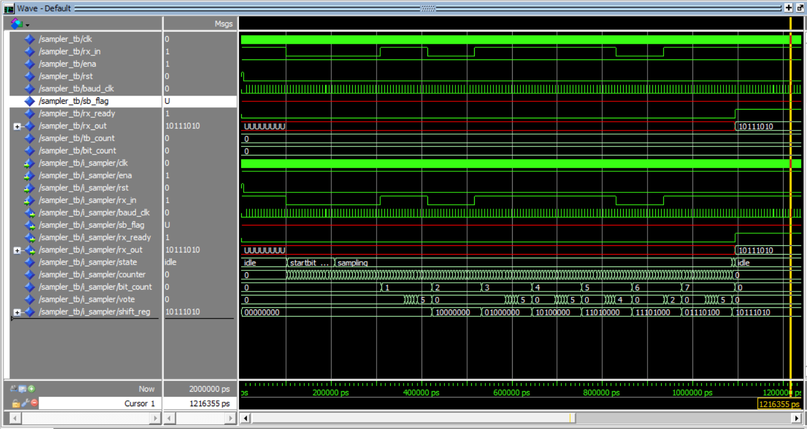

# VHDL---USART

# Logg

## 5/11/2025
- Vi har startet på Rx-modulen og CTRL-modulen
- Elise har lært Github
- Gjort generell planlegging av videre arbeid 
### Hva må gjøres til neste gang?
- Teste opplastning av kode på DE10 
- Teste 7-segment display
- Bli ferdig med baud_gen og lage testbenk

## 7/11/2025
- Ferdigstilt testbenk og baud_gen
- Simulert testbenk i modelsim, ser ut til å funke

### Hva må gjøres til neste gang?
- Baud_gen må integreres i Rx
- Må få R_x til å punktprøve med raten generert av baud_gen 
- Detektere startbit på R_x
- Lage tilstandsdiagram for R_x

## 9/11/25
- Definert porter for mottak av rx_data og rx_valid
- Implementert enkel tilstandsmaskin 
- lagt til intern registervariabel reg_rx
- lagt til LED-styring
- Koblet mottat tegn direkte til 7-segmentdisplayet som ASCII-kode

### Hva må gjøre til neste gang?
- Lage testbenk og simulere
- Kommentere koden ferdig

## 11/11/2025
- Fikk implementert baud_gen i sampler 
- Komt et stykke på sampler 
- Begynt på tilstandsdiagram for sampler, må utbedres
- Oppdaget problemer med klokkedomener og prosesser

### Hva må gjøres til neste gang?
- Tilstandsdiagram for sampler
- Fulføre og skrive tesbenk til sampler
- Teste sampler i Modelsim
- Ide: bruke baud_clk teller til å sample 16 ganger før å så gå videre til neste case

## 12/11/2025
- Fikk utbedret sampler, men gjenstår 6 feil ved forsøk på kompilering i modelsim.
- Sannsynligvis "easy" fix, men mangler funksjonalitet for å ignorere stop-bit.
- Fikk løst problemene knyttet til klokkedomene og konflikt mellom prosesser.

### Hva må gjøres til neste gang?
- Fikse funksjonalitet for å ignorere stop-bit
- Løse feilmeldingene i modelsim 
- Skrive testbenk til sampler 

## 13/11/2025
- Fikk sampler til å kompilere i Modelsim (!)
- Fikk sampler tesbenken til å kompilere, men den fungerer ikke helt som forventet.
- Får ikke til å sende test_byte inn til sampler, litt usikker på årsaken til dette.

### Hva må gjøres til neste gang?
- Fikse testbenken til sampler
- legge til mer funksjonalitet
- Fikse problemer i sampler basert på tilbakemeldinger fra testbenk

## 14/11/2025
- simulert sampler
- Testbenken ser ut til å virke bra
- Sampler vil ikke bytte state på riktig tidspunkt, setter seg enten fast i startbit_detected eller teller for fort og hopper over hele venteperioden, litt usikker på hvordan dette skal løses

### Hva må gjøres til neste gang?
- Finne ut hvordan telleren i sampler i startbit_detected staten kan synkroniseres med baud_clk.
- Etter det er fikset, teste mer og få timingen på plass og mer robuste overganger mellom de ulike tilstandene.

## 15/11/2025
- Endelig fått sampler til å funke! 
- Hovedproblemet var multi-driver "konflikter" (signaler som ble endret flere ganger i samme syklus), hovedsaklig knyttet til de ulike tellerene i sampling tilstanden 
- Måtte også gjøre endringer i baud_gen for å få klokkeperioden til å bli 326
- Testbenk ble også endret for å få riktig tidsforhold mellom generert systemklokke og test signalet som ble sendt inn i sampler

### Hva må gjøres til neste gang?
- Begynne på avr kode
- Lage et blokkskjema til fungerende sampler
- Begynne å planlegge TX, kontroll og top-layer entitet

## 25/11/205
- Vi har tatt en liten pause fra jobbingen, på grunn av radio-eksamen
- PC-trøbbel har hindret noe særlig framgang i dag, men satser på å løse det asap
- Avtalt møte i morgen og lagt plan for en skikkelig innspurt på prosjektet. 
- Planlagt AVR-modul og testing

### Hva må gjøres til neste gang?
- Komme skikkelig i gang med AVR modul
- Begynne å skrive TX og testbenk til TX
- Fikse PC'en til Elise :'( 

## 26/11/205
- Fikk fiksa PC'en til Elise
- Lite annen fremgang 

### Hva må gjøres til neste gang?
- Tx må utvikles videre
- Samme gjelder AVR-modul

## 27.11.25
- har lagt til en state "busy"
- fungerer bra mellom bytting av tilstander
- stimuli 1 og 2 fungerer bra (tegn) men test 3 fungerer ikke?
- må være noe feil med btn_char
- Kan nå sende en forhåndsdefinert streng med 8 tegn

