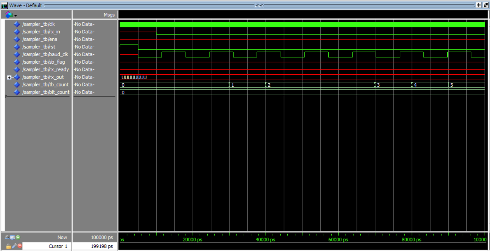

# VHDL---USART

# Logg

## 5/11/2025
- Vi har startet på Rx-modulen og CTRL-modulen
- Elise har lært Github
- Gjort generell planlegging av videre arbeid 
### Hva må gjøres til neste gang?
- Teste opplastning av kode på DE10 
- Teste 7-segment display
- Bli ferdig med baud_gen og lage testbenk

## 7/11/2025
- Ferdigstilt testbenk og baud_gen
- Simulert testbenk i modelsim, ser ut til å funke

### Hva må gjøres til neste gang?
- Baud_gen må integreres i Rx
- Må få R_x til å punktprøve med raten generert av baud_gen 
- Detektere startbit på R_x
- Lage tilstandsdiagram for R_x

## 9/11/25
- Definert porter for mottak av rx_data og rx_valid
- Implementert enkel tilstandsmaskin 
- lagt til intern registervariabel reg_rx
- lagt til LED-styring
- Koblet mottat tegn direkte til 7-segmentdisplayet som ASCII-kode

### Hva må gjøre til neste gang?
- Lage testbenk og simulere
- Kommentere koden ferdig

## 11/11/2025
- Fikk implementert baud_gen i sampler 
- Komt et stykke på sampler 
- Begynt på tilstandsdiagram for sampler, må utbedres
- Oppdaget problemer med klokkedomener og prosesser

### Hva må gjøres til neste gang?
- Tilstandsdiagram for sampler
- Fulføre og skrive tesbenk til sampler
- Teste sampler i Modelsim
- Ide: bruke baud_clk teller til å sample 16 ganger før å så gå videre til neste case

## 12/11/2025
- Fikk utbedret sampler, men gjenstår 6 feil ved forsøk på kompilering i modelsim.
- Sannsynligvis "easy" fix, men mangler funksjonalitet for å ignorere stop-bit.
- Fikk løst problemene knyttet til klokkedomene og konflikt mellom prosesser.

### Hva må gjøres til neste gang?
- Fikse funksjonalitet for å ignorere stop-bit
- Løse feilmeldingene i modelsim 
- Skrive testbenk til sampler 

## 13/11/2025
- Fikk sampler til å kompilere i Modelsim (!)
- Fikk sampler tesbenken til å kompilere, men den fungerer ikke helt som forventet.
- Får ikke til å sende test_byte inn til sampler, litt usikker på årsaken til dette.

### Hva må gjøres til neste gang?
- Fikse testbenken til sampler
- legge til mer funksjonalitet
- Fikse problemer i sampler basert på tilbakemeldinger fra testbenk
