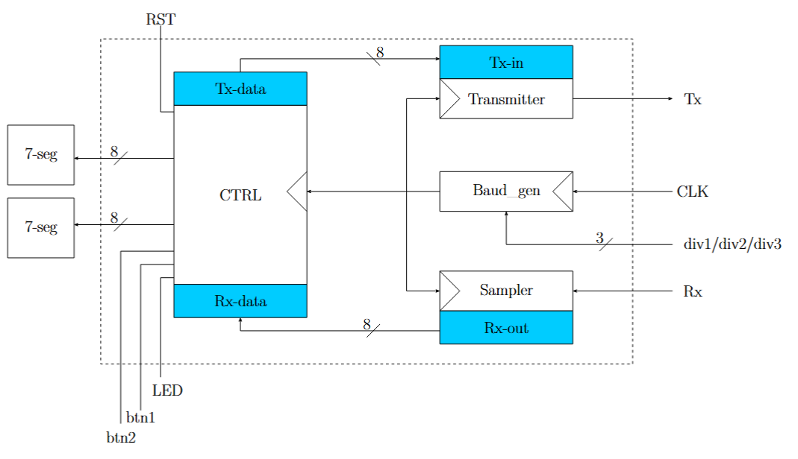
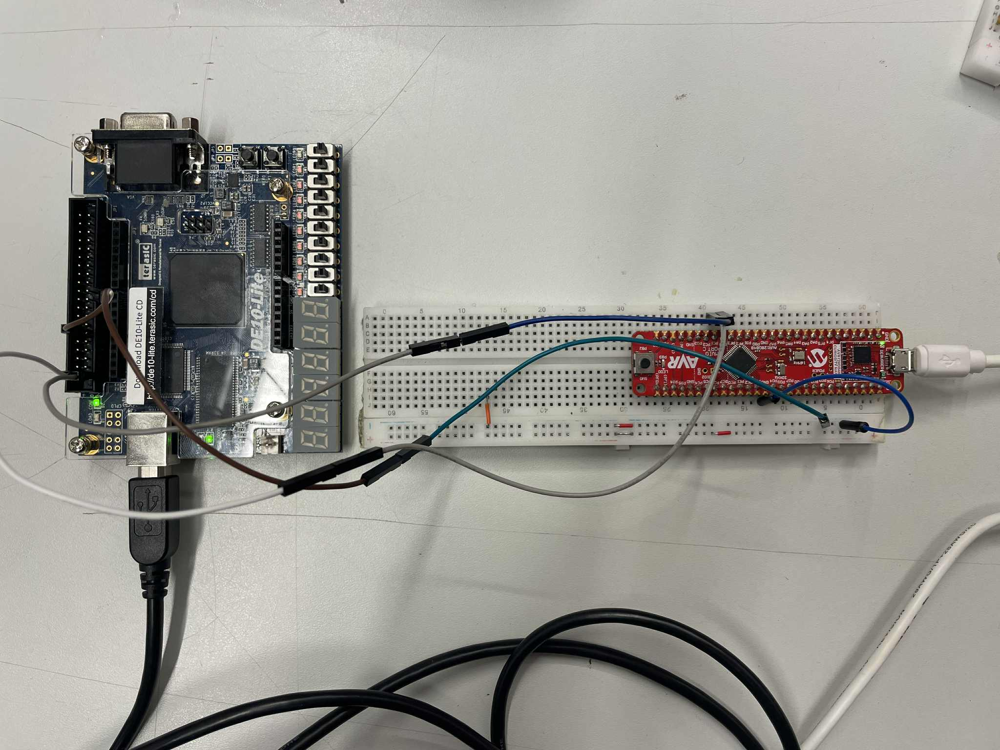

# VHDL USART prosjekt

I dette prosjektet har det blitt skrevet en USART i VHDL. Prosjektet er laget for utviklingskortet DE-10, med FPGA Altera MAX 10M50DAF484C7G. Dette har blitt gjort i faget innvevde systemer (IELS3012). Implementasjonen støtter 9600 baud rate, 1 startbit, 1 stopbit og ingen paritetsbit. Systemet kan bytte mellom to moduser, loop-back og sending av karakterer ved bruk av knappetrykk. Prosjektet inneholder også testbenker til hver enkelt av modulene som inngår i det ferdige systemet.

Implementasjonen og systemarkitekturen er i stor grad inspirert av Microchips arkitektur for USART på [AVR128DB48](https://ww1.microchip.com/downloads/en/DeviceDoc/AVR128DB28-32-48-64-DataSheet-DS40002247A.pdf).

## Systemoversikt 
Implementasjonen består av følgende delsystemer:
- Top level entitet
- Baud generator
- Sampler
- Transmitter 
- Uart control

## Verifisering

Systmet ble verifisert ved bruk av både AVR128DB48 og ESP32. 

